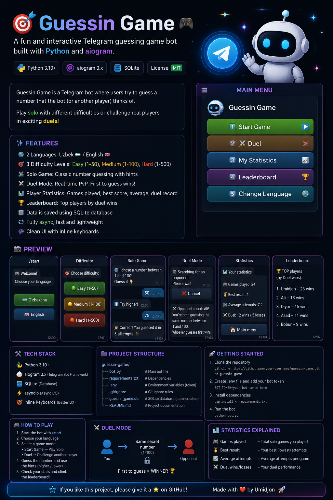

# 🎮 Guessin-Game

<p align="center">
  
</p>

<p align="center">
  <b>🎯 Test your luck. Challenge yourself. Become the best!</b>
</p>

---

## 🚀 About

**Guessin-Game** is an interactive Telegram guessing game built with **Python**.

The goal is simple: choose a difficulty, answer questions, earn points, improve your statistics, and compete for a place on the leaderboard! 🏆

The bot supports **Uzbek 🇺🇿** and **English 🇬🇧**, making the game accessible to more players.

---

## ✨ Features

* 🎮 **Start Game** — Begin a new guessing game
* 🌍 **Language Selection** — Uzbek 🇺🇿 / English 🇬🇧
* ⚡ **Difficulty Levels** — Choose the challenge that suits you
* 📊 **My Statistics** — Track your game performance
* 🏆 **Leaderboard** — Compete with other players
* 🔄 **Change Language** — Switch the bot language anytime
* 🤖 **Telegram Bot** — Play directly from Telegram

---

## 🎯 How to Play

1. Open the bot in Telegram.
2. Press **Start Game**.
3. Select your language.
4. Choose a difficulty level.
5. Answer the questions.
6. Earn points for correct answers.
7. Check your statistics.
8. Try to reach the top of the leaderboard! 🏆

---

## 🛠️ Built With

* 🐍 **Python**
* 🤖 **Telegram Bot API**
* 📦 **python-telegram-bot**
* 🔧 **Git & GitHub**

---

## 📂 Project Structure

```text
Guessin-Game/
│
├── bot.py
├── guessin-game-poster.png
├── requirements.txt
├── README.md
└── .gitignore
```

---

## ⚙️ Installation

### 1. Clone the repository

```bash
git clone https://github.com/YOUR-USERNAME/Guessin-Game.git
```

### 2. Open the project

```bash
cd Guessin-Game
```

### 3. Install dependencies

```bash
pip install -r requirements.txt
```

### 4. Add your Telegram Bot Token

Create a bot using **BotFather** and add your token to the project.

> ⚠️ Never publish your Telegram Bot Token on GitHub.

### 5. Run the bot

```bash
python bot.py
```

---

## 🎮 Game Menu

The bot includes:

```text
🎮 Start Game
📊 My Statistics
🏆 Leaderboard
🌍 Change Language
```

---

## 🌍 Supported Languages

| Language     | Status      |
| ------------ | ----------- |
| 🇺🇿 Uzbek   | ✅ Available |
| 🇬🇧 English | ✅ Available |

---

## 📈 Future Improvements

Some features I may add in future versions:

* 👤 User profiles
* 💾 Better statistics system
* 🏆 Global leaderboard
* 🎖️ Achievements and badges
* 🔥 Daily challenges
* 🎁 Rewards system
* 🎨 More game modes

---

## 👨‍💻 Developer

**Umid**

Built with ❤️ and Python 🐍

---

## ⭐ Support

If you like **Guessin-Game**, consider giving the repository a ⭐ on GitHub!

**Have fun and good luck! 🎯🔥**
